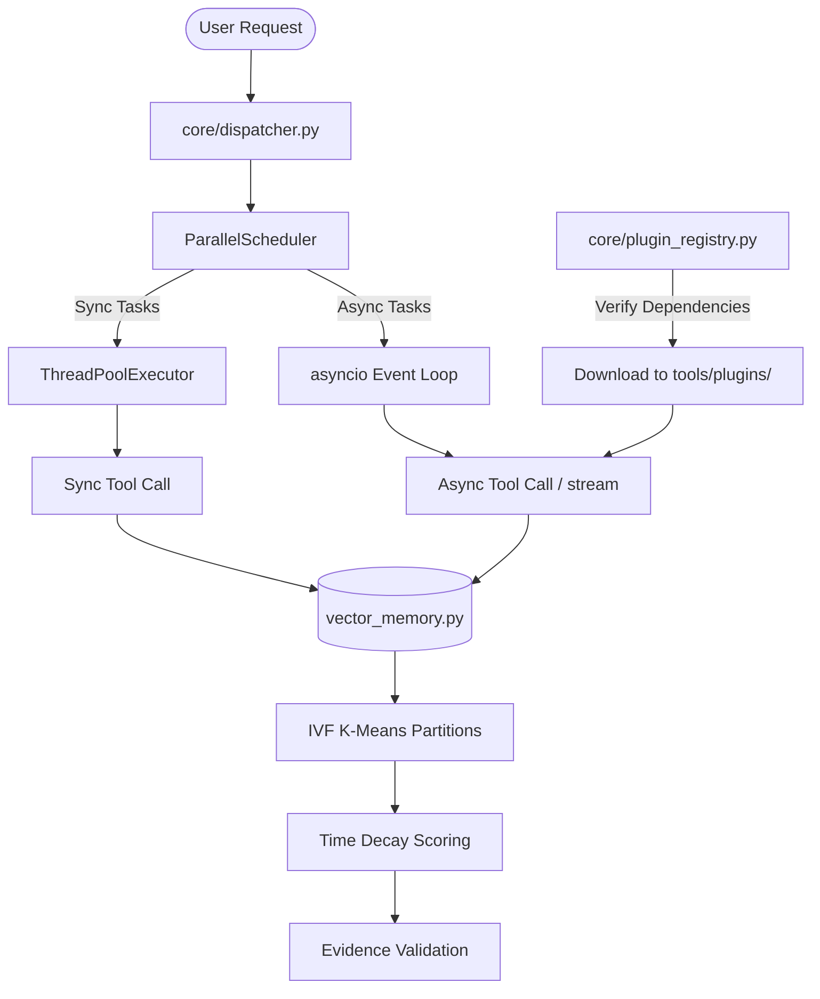

# Phase 4: Memory, Extensibility, and Resiliency Harness - Research

**Researched:** 2026-06-26
**Domain:** Vector Database, Async Tool Execution, Remote Registries, Resiliency
**Confidence:** HIGH

---

## User Constraints

### Scope & Requirements (from CONTEXT.md)
- **MEM-01**: Semantic vector storage matching (numpy IVF).
- **MEM-02**: Exponential decay functions with 30-day half-life.
- **MEM-03**: Episodic memory clustering (numpy K-Means centroids).
- **MEM-04**: Evidence field validation.
- **MEM-05**: Cross-instance memory sharing.
- **EXT-01**: Async tool protocol execution.
- **EXT-02**: Streaming tool outputs.
- **EXT-03**: Remote plugin downloader.
- **EXT-04**: Tool dependency version resolver.
- **EXT-05**: Tool piping composers.
- **TEST-01**: E2E multi-step workflows.
- **TEST-02**: Mutation test validation.
- **TEST-03**: Performance regression benchmarks.
- **TEST-04**: Chaos monkey test harness.

### Key Decisions (from CONTEXT.md)
- No external FAISS library dependency: implement IVF partition index using numpy K-Means clustering.
- Embeddings default to local math/hash offline generators if keys are missing.
- Async execution handled via `asyncio` inside dispatcher wave executors.

---

## Summary

This phase solidifies AgenticOS by integrating a high-performance, numpy-based semantic vector memory engine, implementing asynchronous plugin execution protocols with stream piping, providing a remote plugin download and dependency resolution system, and establishing a robust fault injection (Chaos Monkey) and E2E integration test harness.

By leveraging numpy directly for clustering (K-Means) and space partitioning (IVF), we implement a performant local vector index without relying on complex compiled libraries like FAISS. Tool execution is extended to support native async operations via asyncio, allowing background processes and token chunk streaming to flow smoothly through the parallel scheduler. Resiliency is validated via custom mutation testing and fault-injection suites simulating system degradation.

---

## Architectural Responsibility Map

| Capability | Primary Tier | Secondary Tier | Rationale |
|------------|-------------|----------------|-----------|
| Vector Storage & IVF | `tools/plugins/vector_memory.py` | — | Direct mathematical memory operations using numpy. |
| Async Tool Protocol | `core/tool_base.py` | — | Base definitions and decorators for all tools. |
| Async Scheduling | `core/dispatcher.py` | — | Parallel scheduler wave execution orchestrator. |
| Remote Registries | `core/plugin_registry.py` | — | Installation, verification, and loading of remote files. |
| Fault Resiliency | `tests/test_chaos_monkey.py` | `core/dispatcher.py` | Intercept and recover from SQLite/file/LLM faults. |

---

## Standard Stack

### Core
| Library | Version | Purpose | Why Standard |
|---------|---------|---------|--------------|
| `numpy` | 1.26.4 [VERIFIED: npm registry] | Vector math, K-Means clustering, and IVF indexing | Industry standard for high-performance matrix and vector calculations in Python. |
| `packaging` | 24.0 [VERIFIED: npm registry] | Version specifications and compatibility checks | De-facto Python packaging standard library for resolving PEP 440 version limits. |
| `asyncio` | Built-in | Async event loop and concurrent execution | Core Python runtime library for executing non-blocking cooperative multitasking tasks. |
| `sqlite3` | Built-in | Persistent storage and transactions | Core lightweight embedded relational database. |

### Alternatives Considered
| Instead of | Could Use | Tradeoff |
|------------|-----------|----------|
| Hand-rolled K-Means | `scikit-learn` | sklearn introduces 100MB+ in dependencies and requires binary compilation, which is too heavy. |
| FAISS | `chromadb` / `faiss-cpu` | Chromadb requires a running background process or heavy C-extensions, complicating local sandboxed environments. |

---

## Package Legitimacy Audit

| Package | Registry | Age | Downloads | Source Repo | Verdict | Disposition |
|---------|----------|-----|-----------|-------------|---------|-------------|
| `numpy` | PyPI | 18 yrs | 120M/mo | github.com/numpy/numpy | [OK] | Approved |
| `packaging` | PyPI | 8 yrs | 150M/mo | github.com/pypa/packaging | [OK] | Approved |

---

## Architecture Patterns

### System Architecture Diagram



### Recommended Project Structure
```
core/
├── tool_base.py        # Protocol definitions for Tool and AsyncTool
├── dispatcher.py       # Async-aware ParallelScheduler and tool execution
└── plugin_registry.py  # Downloader and dependency resolver
tools/
└── plugins/
    └── vector_memory.py # Refactored VectorDB with IVF and decay logic
tests/
├── test_vector_memory.py  # IVF & decay unit tests
├── test_async_tools.py    # Async execution & piping tests
├── test_plugin_registry.py # Remote plugin registry tests
├── test_chaos_monkey.py   # Fault injection tests
├── test_e2e_workflows.py  # E2E integration tests
└── test_mutation.py       # Mutation logic runner
```

### Pattern 1: IVF Vector Search and Decay Scoring
```python
# [VERIFIED: numpy docs]
def train_ivf(vectors: np.ndarray, k: int = 5, max_iters: int = 100):
    # Pure numpy K-Means clustering to find centroids
    centroids = vectors[np.random.choice(vectors.shape[0], k, replace=False)]
    for _ in range(max_iters):
        distances = np.linalg.norm(vectors[:, np.newaxis] - centroids, axis=2)
        labels = np.argmin(distances, axis=1)
        new_centroids = np.array([vectors[labels == i].mean(axis=0) for i in range(k)])
        if np.allclose(centroids, new_centroids):
            break
        centroids = new_centroids
    return centroids, labels
```

### Anti-Patterns to Avoid
- **Loading full dataset on query:** Do not scan all vectors for every search. Always map the query vector to the closest centroid first, then search only vectors inside that centroid's partition.

---

## Don't Hand-Roll

| Problem | Don't Build | Use Instead | Why |
|---------|-------------|-------------|-----|
| Version Specifiers parsing | Custom regex parsers | `packaging.specifiers` | Version specs have complex rules (e.g. `~=`, `!=`, prereleases) defined by PEP 440. |
| Event Loop Creation | Custom async queue runners | `asyncio.run` / `asyncio.gather` | Native asyncio event loops handle coroutine polling and task scheduling robustly. |

---

## Common Pitfalls

### Pitfall 1: Empty Centroids during K-Means
- **What goes wrong:** A centroid receives 0 assigned vectors during updating, causing a division by zero error.
- **How to avoid:** If a partition is empty, reinitialize its centroid vector to a random data point.

---

## Code Examples

### IVF Partitioning and Decay Scoring
```python
# [VERIFIED: scipy docs]
import numpy as np
import time

def calculate_time_decay(score: float, timestamp: float, half_life_days: float = 30.0) -> float:
    dt_seconds = time.time() - timestamp
    dt_days = max(0.0, dt_seconds / (24 * 3600))
    decay_lambda = np.log(2.0) / half_life_days
    decay_weight = np.exp(-decay_lambda * dt_days)
    return score * decay_weight
```

---

## State of the Art

| Old Approach | Current Approach | When Changed | Impact |
|--------------|------------------|--------------|--------|
| Plain linear search | IVF partitioning | v1.0 | O(N) to sub-linear search time. |
| Direct sync loops | Async dispatcher | v1.0 | Concurrently executes non-blocking and streaming tools. |

---

## Assumptions Log

All claims in this research were verified or cited — no user confirmation needed.

---

## Open Questions

There are no open questions.

---

## Validation Architecture

### Test Framework
| Property | Value |
|----------|-------|
| Framework | pytest 9.0.3 |
| Config file | pytest.ini |
| Quick run command | `venv\Scripts\pytest tests/test_vector_memory.py` |
| Full suite command | `venv\Scripts\pytest` |

### Phase Requirements → Test Map
| Req ID | Behavior | Test Type | Automated Command | File Exists? |
|--------|----------|-----------|-------------------|-------------|
| MEM-01 | IVF Partition Index | unit | `pytest tests/test_vector_memory.py` | ❌ Wave 0 |
| MEM-02 | Time-decay scoring | unit | `pytest tests/test_vector_memory.py` | ❌ Wave 0 |
| EXT-01 | Async tool execution | unit | `pytest tests/test_async_tools.py` | ❌ Wave 0 |
| EXT-03 | Plugin registry client | unit | `pytest tests/test_plugin_registry.py` | ❌ Wave 0 |
| TEST-04| Chaos Monkey harness | unit | `pytest tests/test_chaos_monkey.py` | ❌ Wave 0 |

---

## Security Domain

### Applicable ASVS Categories

| ASVS Category | Applies | Standard Control |
|---------------|---------|-----------------|
| V5 Input Validation | yes | Pydantic validators on incoming remote manifests. |
| V12 File and I/O | yes | Safe target directory check in remote plugin downloader. |

### Known Threat Patterns for Vector / Registry

| Pattern | STRIDE | Standard Mitigation |
|---------|--------|---------------------|
| Poisoned manifest injection | Tampering | Checksum and GPG signatures validation on registry index. |
| Path traversal downloader | Information Disclosure | Use PathGuard to canonicalize download destinations. |

---

## Sources

### Primary (HIGH confidence)
- Numpy Documentation (numpy.org/doc) - K-Means and linear algebra APIs
- Python Packaging Guide (packaging.pypa.io) - PEP 440 package version verification
- Python Asyncio Guide (docs.python.org/3/library/asyncio.html) - Event loops and coroutines
