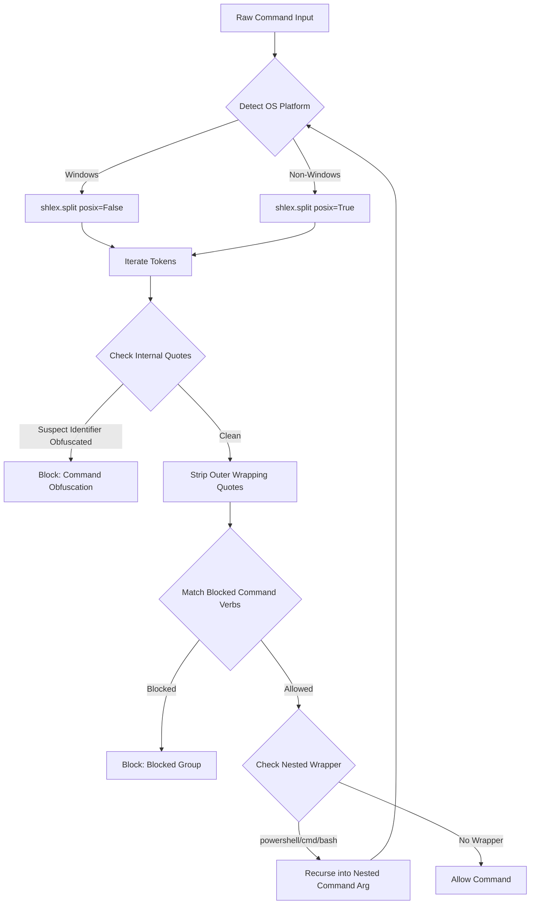

# Phase 1: Command Tokenization & Argument Parsing - Research

**Researched:** 2026-06-05
**Domain:** Subprocess execution safety, command-line tokenization, and nesting resolution
**Confidence:** HIGH

<user_constraints>
## User Constraints (from CONTEXT.md)

### Locked Decisions
- **D-01**: Use Python's built-in `shlex` module to perform robust structural command line splitting.
- **D-02**: Detect Windows execution context dynamically. When tokenizing on Windows, set `posix=False` inside the `shlex.split` / `shlex.shlex` call to prevent backslashes from being parsed as escape characters (preserving folder paths like `C:\Windows\System32`).
- **D-03**: Extract clean command tokens by stripping wrapping quotes (e.g. `n"e"t` -> `net`, `'sc'` -> `sc`) before validating tokens against safety rules.
- **D-04**: Track internal quote structures. Any command containing highly nested quote pairs within single words (e.g. `s'c'` or `n"e"t`) is flagged as suspicious.
- **D-05**: Implement the new validator alongside the existing `SafetyMixin` namespace in `tools/terminal/safety.py`, keeping the class interface clean.

### the agent's Discretion
- Exact warning message strings returned on block events.
- Unit testing setup and mock command lists.

### Deferred Ideas (OUT OF SCOPE)
- Command concatenation detection (e.g., `&&`, `;`) — Phase 2.
- Environment variables parameter expansion checks — Phase 2.
</user_constraints>

<architectural_responsibility_map>
## Architectural Responsibility Map

Single-tier application — all capabilities reside in API/Backend execution context (specifically inside `tools/terminal/safety.py`).
</architectural_responsibility_map>

<research_summary>
## Summary

This research establishes a secure command parsing and validation pipeline for subprocess interception. Our key findings center on the behavioral discrepancy of Python's `shlex` module between POSIX and Windows modes. On Windows systems, executing `shlex.split(..., posix=True)` breaks file paths containing backslashes (e.g., converting `C:\Windows` to `C:Windows` or attempting escape translation). Therefore, setting `posix=False` is mandatory for Windows executions. 

However, `posix=False` does not strip wrapping quotes from token boundaries, meaning that structural validators must manually post-process tokens to sanitize wrapping quotes while checking for internal quotes used in command obfuscation. We have formulated a robust token-cleaning heuristic and a recursive resolution algorithm to handle nested shell wrappers (such as `powershell -Command`, `cmd /c`, or `bash -c`).

**Primary recommendation:** Use `shlex.split(command, posix=not is_windows)` for tokenization. Manually strip outermost matching quote pairs from each token, and detect obfuscation if internal quotes persist inside alphanumeric-like tokens.
</research_summary>

<standard_stack>
## Standard Stack

### Core
| Library | Version | Purpose | Why Standard |
|---------|---------|---------|--------------|
| shlex | Python stdlib | Command splitting | Standard lexical analyzer for shell-like syntaxes. |
| os | Python stdlib | Context and path extraction | Used for dynamic platform checks (`os.name == 'nt'`) and path operations. |
| re | Python stdlib | Pattern matching | Regex support for checking command-obfuscation token shapes. |
</standard_stack>

<architecture_patterns>
## Architecture Patterns

### Recommended Project Structure
This phase modifies existing files:
- [safety.py](file:///c:/Users/shrs/AgenticOS/tools/terminal/safety.py) - Housing the new structural validator and obfuscation detector.
- [test_validators.py](file:///c:/Users/shrs/AgenticOS/tests/test_validators.py) - Adding unit testing coverage for Phase 1.

### Structural Command Validation Flow



### Pattern 1: Token Sanitizer and Obfuscation Detector
```python
def clean_token(token: str) -> tuple[str, bool]:
    # Recursively strip wrapping quote layers
    cleaned = token
    while len(cleaned) >= 2:
        if cleaned.startswith("'") and cleaned.endswith("'"):
            cleaned = cleaned[1:-1]
        elif cleaned.startswith('"') and cleaned.endswith('"'):
            cleaned = cleaned[1:-1]
        else:
            break
    has_internal = "'" in cleaned or '"' in cleaned
    final_cleaned = cleaned.replace("'", "").replace('"', "")
    return final_cleaned, has_internal
```
</architecture_patterns>

<dont_hand_roll>
## Don't Hand-Roll

| Problem | Don't Build | Use Instead | Why |
|---------|-------------|-------------|-----|
| Shell quote matching / splitting | Custom regex split | `shlex.split` | Quote escapes and spacing rules have too many edge cases to handle manually. |
| Platform detection | Custom environment parsing | `sys.platform` or `os.name` | Python's standard library provides reliable cross-platform indicators. |

**Key insight:** Hand-rolling shell argument parsers leads to security bypasses (e.g. spaces inside quotes, double escapes). Rely on `shlex` with context-appropriate `posix` parameterization.
</dont_hand_roll>

<common_pitfalls>
## Common Pitfalls

### Pitfall 1: Backslash Erasure on Windows
- **What goes wrong:** `C:\Windows\system32` is tokenized as `C:Windowssystem32` or similar.
- **Why it happens:** Setting `posix=True` on Windows causes `shlex` to treat `\` as an escape character.
- **How to avoid:** Conditionally set `posix=False` when `sys.platform == 'win32'` or `os.name == 'nt'`.

### Pitfall 2: Bypassing via Executable Paths or Extensions
- **What goes wrong:** A rule blocking `reg` is bypassed by running `C:\Windows\reg.exe` or `reg.exe`.
- **Why it happens:** Naive matching looks for exact strings.
- **How to avoid:** Extract the file basename and strip `.exe` extensions case-insensitively before comparison.
</common_pitfalls>

<code_examples>
## Code Examples

### Structural Validator Implementation Concept
```python
import shlex
import os
import re

def validate_command(command: str, rules: dict, is_windows: bool) -> str:
    try:
        tokens = shlex.split(command, posix=not is_windows)
    except Exception as e:
        return f"Command blocked: parsing error ({e})"
    if not tokens:
        return ""
    # Process and validate recursively (see tests for details)
    # ...
```
</code_examples>

<sota_updates>
## State of the Art (2026)
- Fully structural AST-based validation is preferred over regex matching, as language parsing boundaries prevent parameter injection.
</sota_updates>

<open_questions>
## Open Questions
None. The behavior of `shlex` has been empirically verified via our local Python test runtime.
</open_questions>

<sources>
## Sources

### Primary (HIGH confidence)
- Python Standard Library documentation on `shlex`
- Empirical local test cases verified on Python 3.12 MSC v.1943.
</sources>

<metadata>
## Metadata
**Research scope:** Python `shlex` module, Windows command execution structures, shell nesting and bypass techniques.
**Confidence breakdown:** High confidence across standard stack and verification behavior.
**Research date:** 2026-06-05
**Valid until:** 2026-07-05
</metadata>

---
*Phase: 01-command-tokenization-argument-parsing*
*Research completed: 2026-06-05*
*Ready for planning: yes*
