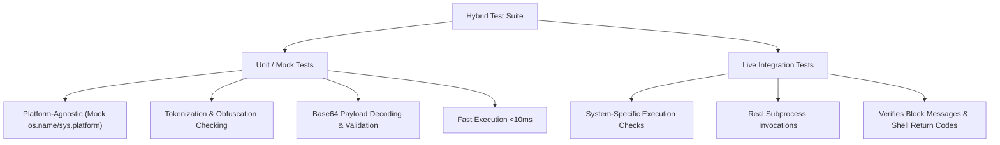

# Phase 4: Safety Verification Suite - Research Report

## 1. Executive Summary

This research report defines the design and implementation details for **Phase 4: Safety Verification Suite**. The phase addresses the requirements of **TEST-01** (comprehensive validation suite) and resolves critical security and operational findings (CR-01, WR-01, WR-02, and Info-level findings) identified in the Phase 3 code review (`03-REVIEW.md`).

The core goals of this phase are:
1. Patching critical security bypasses in PowerShell parameter parsing and Base64 encoded payload validation.
2. Enabling full security scans for Zsh shell scripts by correcting line continuation mapping and comment filtering.
3. Fixing runtime variable scope errors that could suppress security validation logging.
4. Constructing a robust hybrid test suite comprising fast, platform-agnostic unit tests and system-specific live integration tests.
5. Verifying the system against a comprehensive attack matrix of shell obfuscation and execution bypass techniques.

---

## 2. Technical Findings & Implementation Specifications

### CR-01: PowerShell Parameter Prefix Matching & Base64 Decoding

#### The Vulnerability
PowerShell CLI allows parameter name abbreviation as long as the abbreviation uniquely identifies a parameter (e.g., `-c`, `-co`, `-com`, `-comm` all map to `-Command`; `-e`, `-en`, `-enc`, `-encoded` all map to `-EncodedCommand`). 
The current implementation in `tools/terminal/safety.py` only performs an exact match against a static set `{"-command", "-c", "/command", "/c"}`. As a result:
1. Any abbreviated wrapper flag (like `powershell -comm "sc stop"`) completely bypasses the recursive check.
2. The `-EncodedCommand` execution path (which allows base64-obfuscated commands) is never checked.

#### Prefix Matching Design
We will implement prefix matching dynamically. A parameter token is recognized as a PowerShell execution flag if its lowercase form (ignoring leading `-` or `/`) matches a prefix of the target keyword:
- **Command flag**: Prefix of `"command"`.
- **EncodedCommand flag**: Prefix of `"encodedcommand"`.

```python
def _is_powershell_command_flag(token: str) -> bool:
    t = token.lower()
    if not (t.startswith("-") or t.startswith("/")):
        return False
    flag = t[1:]
    return len(flag) > 0 and "command".startswith(flag)

def _is_powershell_encoded_flag(token: str) -> bool:
    t = token.lower()
    if not (t.startswith("-") or t.startswith("/")):
        return False
    flag = t[1:]
    return len(flag) > 0 and "encodedcommand".startswith(flag)
```

#### Base64 Payload Decoding & Validation
PowerShell's `-EncodedCommand` accepts a Base64-encoded string representing a UTF-16LE Unicode command.
To validate it, we must:
1. Strip wrapping quotes from the payload.
2. Remove internal whitespace.
3. Add missing Base64 padding (`=`).
4. Decode using base64 and decode bytes to `utf-16-le`.
5. Run the decoded string through the recursive `_blocked_command_reason` validator.
6. If decoding fails, block the command (fail-safe).

```python
import base64

# Within Step 6 of _blocked_command_reason:
# For each token:
if _is_powershell_encoded_flag(token) and i + 1 < len(tokens):
    encoded_payload = self._strip_wrapping_quotes(tokens[i + 1])
    if self._contains_variable(encoded_payload):
        return "Command blocked: environment variable expansion in wrapper parameters"
        
    try:
        # Standardize padding and decode
        clean_payload = "".join(encoded_payload.split())
        missing_padding = len(clean_payload) % 4
        if missing_padding:
            clean_payload += "=" * (4 - missing_padding)
        decoded_bytes = base64.b64decode(clean_payload)
        decoded_cmd = decoded_bytes.decode("utf-16-le")
    except Exception as e:
        return f"Command blocked by safety rules: unable to decode base64 payload ({e})"
        
    nested_reason = self._blocked_command_reason(decoded_cmd)
    if nested_reason:
        return nested_reason
```

---

### WR-01: Zsh Script Line Validation & Comment Filtering

#### Missing Continuation Map
In `tools/terminal/runner.py`, Zsh script scanning is skipped because `.zsh` is missing from `_CONTINUATION_CHARS`. Adding `".zsh": "\\"` ensures the script is checked line-by-line.

#### Comment Filtering Gap
In `_validate_script_content`, comments are filtered only if the suffix matches `.sh`, `.bash`, or `.ps1`. We must update this to include `.zsh` so that comment lines beginning with `#` are ignored rather than processed as commands.

```python
# In tools/terminal/runner.py:
_CONTINUATION_CHARS = {
    ".sh": "\\",
    ".bash": "\\",
    ".zsh": "\\",     # Added
    ".ps1": "`",
    ".cmd": "^",
    ".bat": "^",
}

# Inside _validate_script_content:
if suffix in (".sh", ".bash", ".zsh", ".ps1"): # Added .zsh
    if stripped.startswith("#"):
        is_comment = True
```

---

### WR-02: Variable Scope in `core/runtime.py`

#### The Issue
If the tool-call audit logging block (lines 716-743) raises an exception, the variables `ok` and `obs_text` are not bound. The next `try` block references `ok` and `obs_text`, raising an `UnboundLocalError`.

#### The Fix
Declare default values for `obs_text` and `ok` in the outer scope before entering the tool audit log `try` block.

```python
obs_text = str(obs or "")
ok = False
# Audit log tool call (no chat content).
try:
    ...
```

---

### Info-Level Refactorings (IN-01, IN-02, IN-03)

1. **IN-01: Google-style Docstrings**:
   Update `run_command`, `run_powershell`, and `run_python` to include fully specified parameters, return values, and behavior.
2. **IN-02: Code Duplication**:
   Extract command parsing and self-healing into a private method:
   `_attempt_self_healing(self, command: str, timeout: int, cwd: Optional[str], input_data: Optional[str], env_extra: Optional[dict]) -> Optional[str]`
3. **IN-03: Alphabetical Imports**:
   Sort imports in `core/runtime.py` using `ruff`.

---

## 3. Hybrid Test Suite Architecture

To balance execution speed, platform independence, and real-world system verification, a hybrid testing strategy is proposed:



### Unit & Mock-Based Tests
- **Location**: `tests/test_terminal_safety_structural.py`
- **Scope**: Validate parsing edge cases, base64 decoders, nested wrappers, environment variable checks, and quote obfuscation.
- **Fixture**: Use `DummyRunner` (inheriting from `SafetyMixin` and `RunnerMixin`) to intercept subprocess execution and run safety scans exclusively.
- **Monkeypatching**: Use `pytest`'s `monkeypatch` to simulate POSIX/Windows execution environments (mocking `os.name = "nt"` / `"posix"`).

### Live Integration Tests
- **Location**: `tests/test_terminal_safety_integration.py`
- **Scope**: Verify that real shell executions fail with security errors when a blocked command is dispatched.
- **Environment**: Dynamically skip tests if the target shell is unavailable on the host system.
  ```python
  import shutil
  import pytest
  
  @pytest.mark.skipif(not shutil.which("powershell"), reason="PowerShell not installed")
  def test_live_powershell_blocked():
      # Instantiate active runner and verify real shell execution blocks
      ...
  ```

---

## 4. Full Attack Matrix Test Cases

Below is the verification attack matrix to be added to the test suite. All blocked cases must trigger a normalized safety warning.

| Attack Vector | Payload Example | Expected Outcome | Safety Rule Breached |
| :--- | :--- | :--- | :--- |
| **PowerShell Abbreviation** | `powershell -comm "sc stop spooler"` | **Blocked** | Service Control (`sc`) |
| **PowerShell Prefix Case** | `powershell -CoM "reg add HKLM"` | **Blocked** | Registry Edit (`reg`) |
| **PowerShell Base64** | `powershell -enc cwBjACAAcwB0AG8AcAAgAHMAcABvAG8AbABlAHIA` | **Blocked** | Service Control (`sc`) |
| **PowerShell Base64 Abbrev**| `pwsh -e cgBlAGcAIABhAGQAZAAgAEgASwBMAE0A` | **Blocked** | Registry Edit (`reg`) |
| **PowerShell Base64 Variable**| `powershell -enc $encoded_payload` | **Blocked** | Env Variable Expansion |
| **PowerShell Base64 Invalid** | `powershell -enc invalid_base64_payload` | **Blocked** | Base64 Decode Failure |
| **Zsh Line Continuation** | `sc \\\nstop spooler` (inside `.zsh` script) | **Blocked** | Service Control (`sc`) |
| **Zsh Blocked comment** | `# sc stop spooler` (inside `.zsh` script) | **Allowed** | Comment line skipped |
| **Chaining: Subshell** | `echo $(sc query)` | **Blocked** | Shell chaining operator (`$()`) |
| **Chaining: Backticks** | ``echo `net stop spooler``` | **Blocked** | Shell chaining operator (`` ` ``) |
| **Obfuscation: Windows Caret**| `s^c q^u^e^r^y` | **Blocked** | Command obfuscation |
| **Obfuscation: POSIX Slash** | `s\c q\u\e\r\y` | **Blocked** | Command obfuscation |
| **Obfuscation: Ticks** | `s`c stop` | **Blocked** | Command obfuscation |
| **Obfuscation: Nested Quotes**| `sc st""op spooler` | **Blocked** | Command obfuscation |
| **Env Var: Verb position** | `%COMSPEC% /c sc stop` | **Blocked** | Env Var in verb position |
| **Env Var: Wrapper param** | `cmd /c %systemroot%\\system32\\sc.exe` | **Blocked** | Env Var in wrapper param |
| **Benign quotes** | `echo "sc stop spooler"` | **Allowed** | Normal argument string |

---

## 5. Verification & Test Plan

1. **Local Test Execution**:
   Verify the existing suite remains fully functional:
   `pytest tests/test_terminal_safety_structural.py`
2. **Implementation Check**:
   Confirm that parser performance remains under the **10ms** threshold per command verification.
3. **Cross-Platform Verification**:
   Execute tests with `os.name` monkeypatched to both `"nt"` and `"posix"` to ensure parser rules apply correctly across systems.
