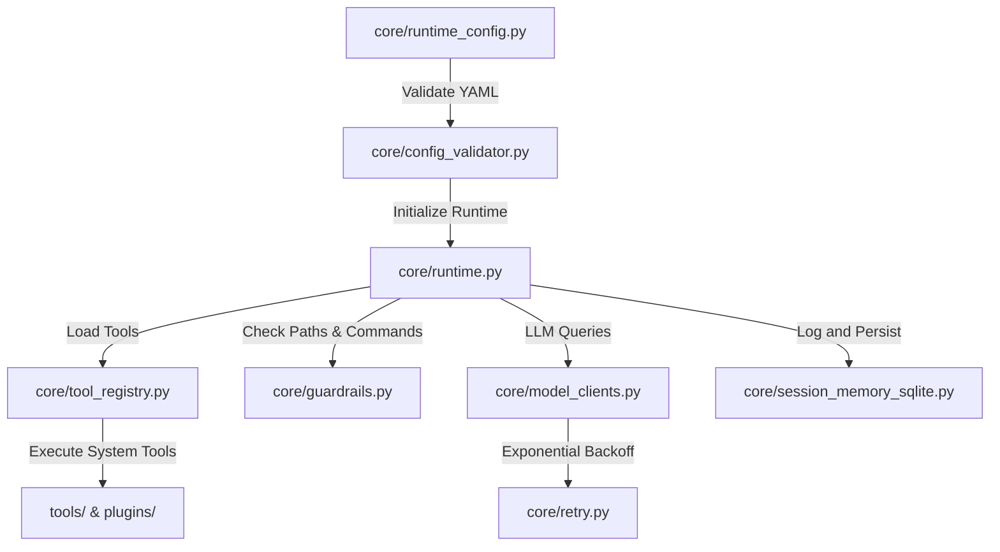

# AgenticOS Core Runtime Engine

The `core/` directory contains the foundational systems that drive AgenticOS: the execution loop, model interfaces, security guardrails, configuration validations, persistent memory management, and terminal UIs.

---

## Architectural Blueprint

The runtime architecture of AgenticOS follows a highly coupled, zero-trust lifecycle:

---

## Key Subsystems & Modules

### 1. Agent Execution Loop (`core/runtime.py`)
The central coordinator of AgenticOS. It manages the agent's main thought-action-observation loop:
- **Iteration Tracking**: Enforces hard loop limits to prevent infinite recursion or cost overruns.
- **Human-In-The-Loop**: Pauses execution and requests interactive operator permission for destructive commands or Yellow Zone filesystem operations.
- **Self-Correction & Fallbacks**: Dynamically changes provider endpoints or LLM configurations if repeated errors or empty loops occur.

### 2. Provider API Clients (`core/model_clients.py` & `core/retry.py`)
An abstraction layer for cloud and local LLM backends (Gemini, Groq, Nvidia, OpenAI, Ollama, OpenRouter).
- **Exponential Backoff**: Integrated with `core/retry.py` using standard exponential backoff and jittered retries to elegantly handle HTTP 429 (Rate Limit) errors.
- **Payload Redaction**: Automatically filters system and user credentials before transmitting payloads to external clouds.

### 3. Zero-Trust Security (`core/guardrails.py`)
Enforces safe and compliant execution constraints:
- **PathGuard**: Restricts file modifications based on zones (Green: unrestricted `workspace/`; Yellow: HITM-required system paths; Red: fully blocked operating system zones).
- **Command Sanitizer**: Intercepts shell scripts to block dangerous operations such as formatting, system shutdown, or user privilege modifications.

### 4. Registry & Plugins (`core/tool_registry.py` & `core/tool_base.py`)
Loads, parses, and dynamically registers all workspace capabilities:
- **Namespace Reuse**: Reuses cached modules inside `sys.modules` to prevent import collisions and mock leaks in testing environments.
- **Dynamic hot-reloads**: Automatically registers new modules and tools decorated with `@tool` without system reboots.

### 5. Persistent Session Memory (`core/session_memory_sqlite.py`)
Maintains agent state across tasks and system reboots:
- **SQLite Engine**: Stores task definitions, intermediate agent thoughts, tools called, and result payloads.
- **Analytics Database**: Provides an audit trail for performance metrics and regression analysis.

---

## Core File Reference

| Module Name | High-Level Responsibility | Category |
| :--- | :--- | :--- |
| [runtime.py](file:///c:/AgenticOs/core/runtime.py) | Coordinates the main execution loop and schedules task resolution. | Loop |
| [model_clients.py](file:///c:/AgenticOs/core/model_clients.py) | Abstraction layer for Gemini, Groq, Nvidia, and OpenAI API calls. | Model |
| [guardrails.py](file:///c:/AgenticOs/core/guardrails.py) | Implements PathGuard rules and active command blacklists. | Security |
| [session_memory_sqlite.py](file:///c:/AgenticOs/core/session_memory_sqlite.py) | Persists tool invocation history and agent thoughts to SQLite. | Memory |
| [tool_registry.py](file:///c:/AgenticOs/core/tool_registry.py) | Discovers, imports, and exposes standard modules and dynamic plugins. | Extensibility |
| [retry.py](file:///c:/AgenticOs/core/retry.py) | Provides centralized exponential backoff and jittered retries. | Network |
| [config_validator.py](file:///c:/AgenticOs/core/config_validator.py) | Ensures the integrity of YAML files and system credentials. | Config |
| [runtime_ui.py](file:///c:/AgenticOs/core/runtime_ui.py) | Manages terminal output formatting and typewriter printing. | Interface |

---

## Development Philosophy

The `core/` package is strictly isolated from application-specific business logic. It handles the raw plumbing of the agent framework, ensuring that security, memory persistence, API communication, and command execution are completely robust and predictable.
