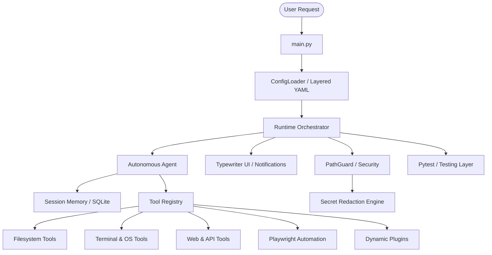

# AgenticOS: System Architecture

AgenticOS is a secure, autonomous agentic framework designed for high-performance local and cloud-based operations. This document provides a deep dive into the internal mechanics, orchestration loop, and modular design of the system.

## Core Philosophy
The architecture is built on four pillars:
1.  **Autonomy**: The agent should handle ambiguity and recover from errors without human intervention.
2.  **Safety**: A multi-layered guardrail system protects the host OS from destructive actions.
3.  **Observability**: Every thought, action, and tool output is tracked and logged in real-time.
4.  **Extensibility**: A robust plugin system allows for seamless "Self-Evolution" of tool capabilities.

---

## High-Level Component Overview

---

## The Orchestration Loop (Execution Cycle)

AgenticOS follows a strict, iterative "Replan-Act-Verify" loop managed by `core/runtime.py`.

### 0. Configuration Layer
Before the loop starts, the `ConfigLoader` merges multiple YAML sources from the `config/` directory:
- **`runtime.yaml`**: Environment-specific paths and heuristics.
- **`policy.yaml`**: Security rules and redaction patterns.
- **`endpoints.yaml`**: External URLs and service presets.
- **`prompts.yaml`**: System prompts and instruction templates.

### 1. Context Assembly
Before every iteration, the Orchestrator assembles the "Global Context Window":
-   **System Prompt**: Core behavioral instructions and tool definitions.
-   **Session History**: Trimmed and summarized conversation history from SQLite.
-   **Live Metrics**: CPU, RAM, and Disk health snapshots to inform resource-heavy decisions.
-   **Task State**: The current `OBJECTIVE`, `PLAN`, and `CURRENT_STEP`.

### 2. Model Inference
The assembled context is sent to the configured provider (Ollama or Nvidia Cloud). AgenticOS uses a "Reasoning-First" approach, where the model is encouraged to think before generating an `ACTION`.

### 3. Action Dispatching
When the model generates an `ACTION` block, the `ToolRegistry` intercepts it.
-   **Validation**: The tool name and arguments are checked against the registry schema.
-   **Security Check**: The `PathGuard` evaluates filesystem paths, and the `SafetyMixin` parses and validates terminal commands (blocking shell chaining, obfuscation, or script violations).
-   **Dispatch**: If allowed, the tool is executed natively (Python, PowerShell, or Bash).

### 4. Observation and Self-Healing
The tool output (the `OBSERVATION`) is fed back into the model. If a tool fails (e.g., "File not found"), the `Self-Healing` logic kicks in:
-   **Auto-Correction**: The agent identifies the error and attempts a different approach (e.g., searching for the file instead of guessing the path).
-   **Auto-Installation**: If a tool fails due to a missing Python module, the registry autonomously calls `pip install` and hot-reloads the module.
-   **Fallback Models**: If the primary model generates invalid JSON, the orchestrator can transparently retry with a secondary, more structured model.

---

## Memory Management (Long-Term and Short-Term)

### Context Engine and SQLite Backend
Unlike standard chatbots, AgenticOS utilizes a persistent SQLite database (e.g., `memory.sqlite3`) to track tool events, artifacts, and preferences. In tandem, the **Context Engine** (`core/context_engine.py`) and **Memory Manager** (`core/memory_manager.py`) enhance short and long-term recall:
-   **Active Recall**: Retrieves relevant context dynamically based on user prompts.
-   **Commitments**: Tracks follow-up actions and reminders.
-   **Dynamic File Injection**: Automatically injects small workspace `.md` files into the context window.
-   **Long-Term Memory**: Consolidates completed tasks into `workspace/MEMORY.md` and generates daily logs in `workspace/memory/`.

### Summarization and Compaction Logic
To prevent context window bloat, the agent automatically compresses history when it exceeds a defined threshold (e.g., 40 messages). This LLM-powered compaction distills old messages into a highly dense context block while preserving semantic meaning, ensuring the agent retains critical goal-oriented context while discarding low-value intermediate steps.

---

## Tool Registry and Plugin Architecture

The registry (`core/tool_registry.py`) is the brain of the agent's capabilities. It manages over 350+ tools across several categories and automatically loads dynamic plugins from the `tools/plugins/` directory.

### Category Breakdown
| Category | Primary Tools | Implementation Type |
| :--- | :--- | :--- |
| **Filesystem** | `read_file`, `write_file`, `grep_dir` | Native Python / pathlib |
| **Terminal** | `run_powershell`, `process_list` | Subprocess / OS APIs |
| **Web** | `web_search`, `fetch_url`, `rss_feed` | HTTP Requests / Scrapers |
| **Automation** | `browser_launch`, `mouse_click` | Playwright / PyAutoGUI |
| **Security** | `eventlog_query`, `system_health` | Windows WMI / EventLog |

### Fast-Disk Audit System
One of the most advanced components of the architecture is the **Fast-Path** optimization. When performing high-load tasks (like scanning the entire `C:` drive), the agent bypasses slow `pathlib.Path.rglob` operations and utilizes an optimized, stack-based native Python DFS `os.scandir` crawler for near-instant execution (scanning 500,000 files in under 10 seconds).

---

## Security and Zero-Trust Guardrails

The architecture enforces a "Zero Trust" model for the local system using three primary security coordinates:
1.  **PathGuard Security Zones**: Controls filesystem boundary access which can be dynamically switched at runtime via the `/zone` CLI command:
    -   **Green Zone (Workspace isolation)**: Full autonomous access inside `workspace/`; write/delete outside workspace requires a **Human-In-The-Middle (HITM)** confirmation.
    -   **Yellow Zone (System-wide write access)**: PathGuard is active, but outside-workspace writes are allowed autonomously without human approval.
    -   **Red Zone (Protected Assets)**: PathGuard is completely disabled; the agent has unrestricted filesystem access.
    -   **Blue Zone (Read-Only / Audit)**: All write and delete operations are blocked system-wide.
2.  **Structural Command Validation**: Intercepts terminal commands at the parser level (`SafetyMixin`) before execution to block shell chaining, quote obfuscations, and base64 PowerShell scripts. Script files are audited line-by-line using custom continuations filters.
3.  **Secret Redaction Engine**: Automatically masks API keys, tokens, and sensitive PII in all logs and memory stores based on regex patterns in `policy.yaml`.

---

## Performance Characteristics

| Metric | Target | Real-World Performance |
| :--- | :--- | :--- |
| **UI Latency** | < 10ms | Optimized block-printing removes typewriter lag. |
| **API Resilience** | 100% | Exponential backoff masks all 429 Rate Limit errors. |
| **Startup Time** | < 2s | Hot-reloading enables near-instant initialization. |
| **File Indexing** | 3M files/min | Optimized Python DFS scans prevent system lockup and process startup overhead. |

---

##  Lifecycle of a Task

1.  **Initialize**: `main.py` loads the `.env` file and `config.yaml`, then starts the `Runtime`.
2.  **Objective**: User provides a prompt; Agent breaks it into a 5-10 step `PLAN`.
3.  **Iterate**: Agent executes tools one by one, updating the `CURRENT_STEP`.
4.  **Verify**: Agent calls `file_exists` or `read_file` to confirm the task is done.
5.  **Finalize**: Agent produces a `FINAL ANSWER` and shuts down cleanly.

---

## Hardening and Resilience Checklist
Before deploying AgenticOS in an enterprise environment, ensure the following:
- [ ] `autopilot` is enabled for non-blocking runs.
- [ ] `sqlite` backend is active for persistent artifact tracking.
- [ ] `nvidia` or `gemini` cloud providers are configured for complex reasoning tasks.
- [ ] `PathGuard` is enabled with `require_hitm_outside_workspace: true`.

---

*Last Updated: 2026-05-13*
*Status: Verified Project*

## Key Abstractions

- **`SafetyMixin`** ([tools/terminal/safety.py](../tools/terminal/safety.py)): Implements structural command tokenization, PowerShell flag prefix matching, Base64 payload decoding, and shell chaining/obfuscation interception.
- **`RunnerMixin`** ([tools/terminal/runner.py](../tools/terminal/runner.py)): Defines core terminal execution tools (`run_command`, `run_powershell`, `run_script`), intercepts calls via safety rules, and performs line-by-line script checks.
- **`AgentRuntime`** ([core/runtime.py](../core/runtime.py)): Coordinates the main thought processing, replanning, tool execution, and error handling loop.
- **`ToolRegistry`** ([core/tool_registry.py](../core/tool_registry.py)): Decorator-based registry (`@tool`) enabling dynamic capability lookup, hot-reloading, and schema verification.
- **`AuditLogger`** ([core/audit_logger.py](../core/audit_logger.py)): Handles security validation audits and records incidents to persistent storage.

## Directory Structure Rationale

- **`core/`**: Houses the main runtime, memory managers, database controllers, and zero-trust security gatekeepers (PathGuard, audit logger).
- **`tools/`**: Categorized tool libraries (filesystem, web, OS) and the dynamic `plugins/` directory to simplify self-evolution.
- **`config/`**: Layered YAML files defining providers, policy bounds, and system configurations to eliminate hardcoding.
- **`tests/`**: Automated test suite mapping to all core components and filesystem plugins.
