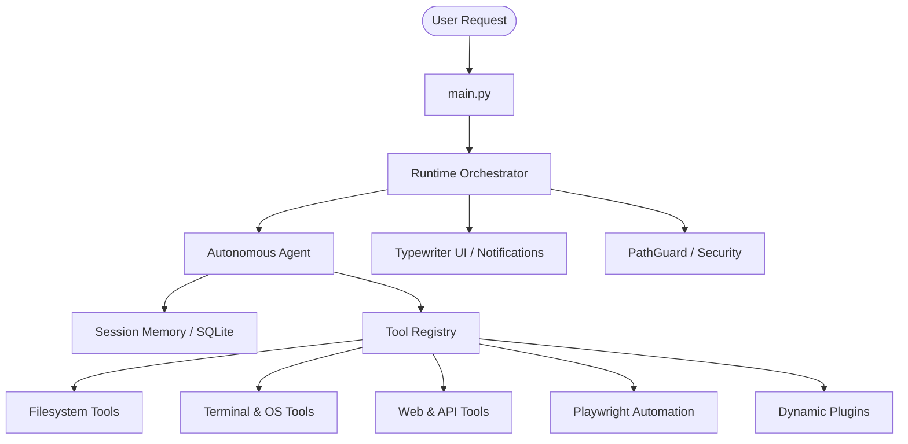
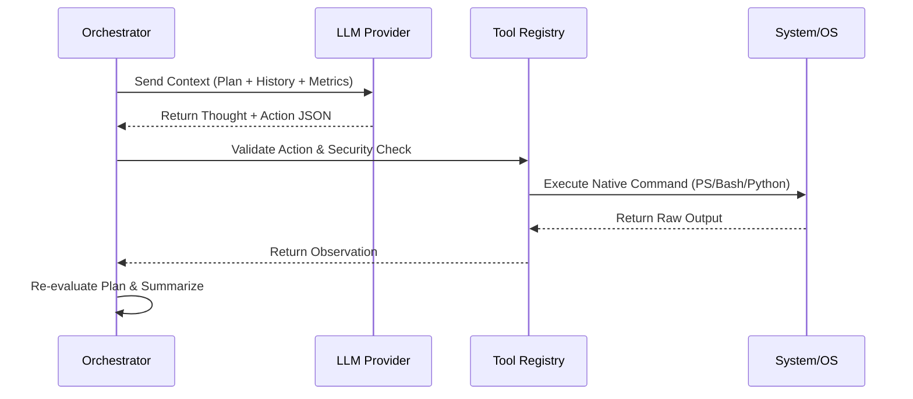
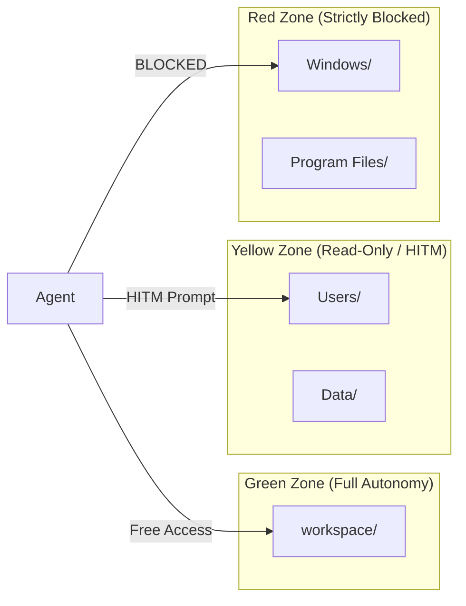
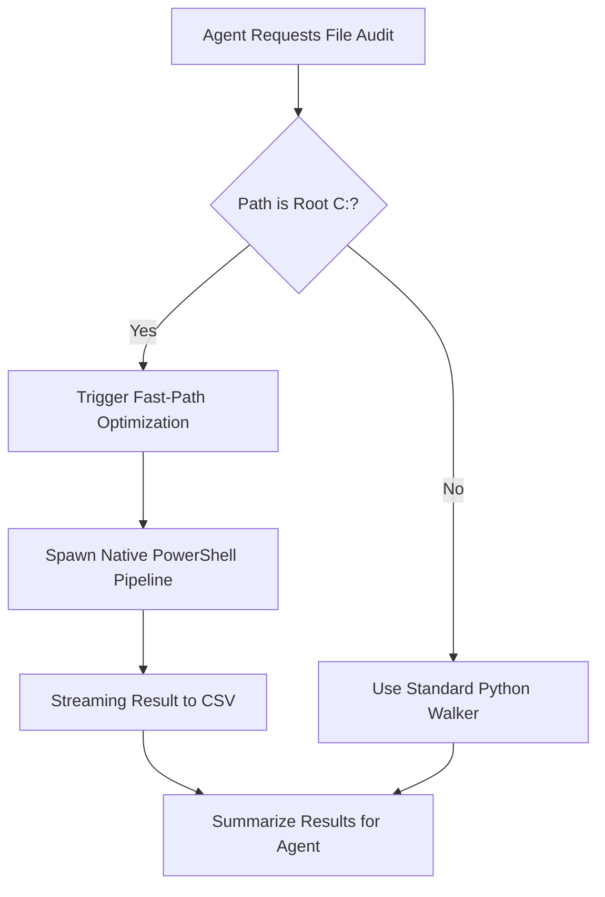
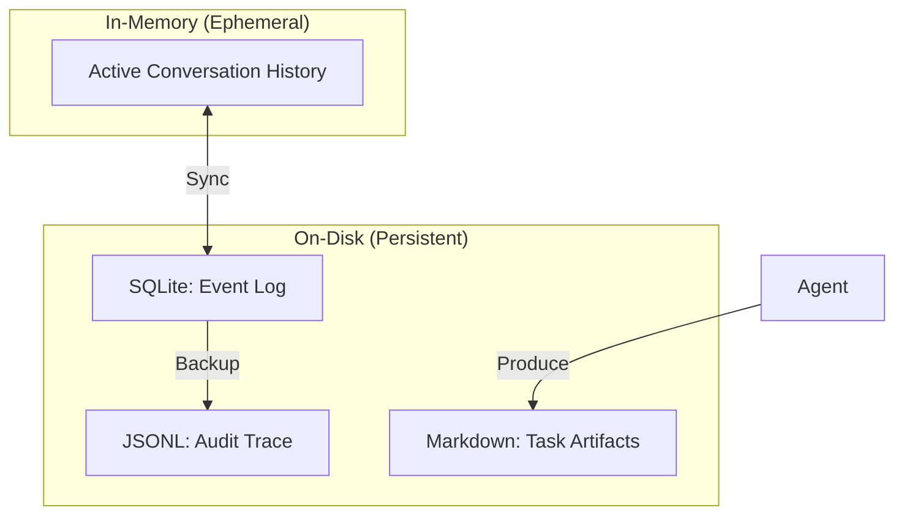

# AgenticOS: Visual Index and Flowcharts

This document serves as a central hub for all technical diagrams and architectural flowcharts within AgenticOS. It provides a visual representation of how the agent thinks, acts, and maintains system safety.

---

## The System Macro-Architecture

This diagram shows the high-level relationship between the user, the core orchestrator, and the host operating system.

---

## The Reasoning Cycle (Cortex Engine)

The internal logic flow of a single agent iteration.

---

## Zone-Based Security (PathGuard)

How AgenticOS categorizes your filesystem and enforces safety.

---

## The "Fast-Path" Optimization Flow

How the system switches between slow Python processing and high-speed PowerShell pipelines.

---

## Persistent Memory Layers

The relationship between short-term context and long-term SQLite storage.

---

## Summary
These diagrams represent the "Hardened" v2.1.0 architecture. For deeper technical details, use the [Documentation Catalog](CATALOG.md) or the links in the [README](../README.md).

---

*Last Updated: 2026-05-14*
*Status: Visual Index Verified*
