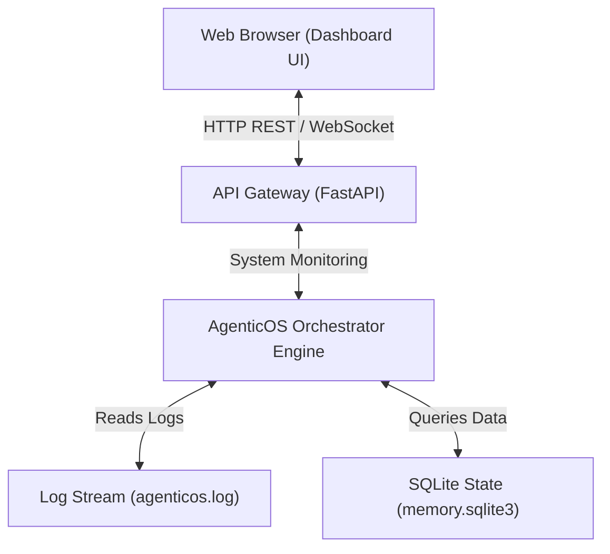

# AgenticOS Web Interface (Web UI) Developer and Setup Guide

This document describes the architecture, installation, configuration, and operation of the AgenticOS Web Interface (Web UI). The Web UI provides a premium, low-latency, glassmorphic dashboard for monitoring system telemetry, reviewing agent thoughts, managing tools, and executing tasks interactively.

---

## 1. System Architecture

The AgenticOS Web UI is constructed as a decoupled, high-performance web application consisting of a local asynchronous backend API and a responsive front-end graphical interface.



### Components
1. **API Gateway (FastAPI)**: Integrates directly into the `core` engine to expose REST endpoints and a WebSocket channel for raw event streams.
2. **Control HUD (HTML5 / Vanilla JavaScript)**: Renders a futuristic dark-theme interface with zero external CSS dependencies or bloatware, ensuring rapid response times.

---

## 2. Setting Up the Environment

To prepare AgenticOS to serve the Web UI, follow this sequential setup plan.

### Step 1: Install Backend Prerequisites
The Web UI requires FastAPI and Uvicorn for local asynchronous routing and request dispatching. Install these packages inside the virtual environment:
```powershell
.\venv\Scripts\pip install fastapi uvicorn
```

### Step 2: Establish the UI Directory Layout
Create a new directory called `web_ui` in the root of the AgenticOS workspace to store the static front-end assets:
```text
AgenticOs/
└── web_ui/
    ├── index.html     # Structural layout and panels
    ├── style.css      # Premium glassmorphic stylesheets
    └── app.js         # Interactive REST, WebSocket, and chart bindings
```

---

## 3. Web UI Panel Design Specification

The dashboard layout is segmented into a multi-column terminal grid to ensure total observability of agent operations.

### Grid Components

#### Panel A: Telemetry and System Diagnostics
- **Metrics**: Real-time CPU usage percentage, memory allocation indicators, disk read/write throughput, and active execution loop timers.
- **Visuals**: Dynamic canvas grids displaying running line graphs of critical host resources.

#### Panel B: Agent Monologue and Thinking Canvas
- **Telemetry**: A chronological flow displaying current sub-goals, thoughts, actions, and observations.
- **State Indicator**: Color-coded banners reflecting the orchestrator's state (Thinking, Executing, Waiting for Human Approval, Suspended).

#### Panel C: Interactive Command Console
- **Features**: An integrated console window that accepts raw text prompts, enabling operators to submit tasks directly from the browser.
- **Human-in-the-Middle (HITM) Gate**: A modal popup presenting approval controls (Approve / Deny) for files or services inside the Yellow Zone.

#### Panel D: Tool Control Center
- **Directory**: A searchable, tabular index mapping all 180+ tools in the registry.
- **Control**: Toggle switches allowing operators to lock specific tools dynamically or adjust their authorization levels.

---

## 4. Launching the Web UI

Once the assets are created, you can initiate the Web UI through the standard CLI:

```powershell
agent --ui
```

This starts the local FastAPI server and automatically launches the dashboard in your default browser at:
`http://localhost:8000`

---

*Last Updated: 2026-05-18*
*Status: Architecture Standard*
