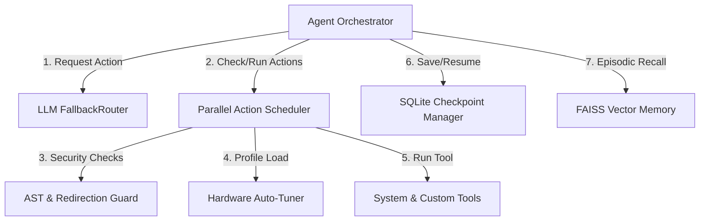

<!-- generated-by: gsd-doc-writer -->
# Architecture Overview

## System Overview
AgenticOS is structured as a modular operating system control framework. It decouples task planning, command dispatching, host security, and environment profiling. The framework is designed to run in a loop where the orchestrator receives user intents, queries the model clients for actions, validates those actions against a strict zero-trust sandbox, schedules independent actions in parallel, updates memory contexts with exponential decay filters, and handles errors with transient retry logic.

---

## Component Diagram

---

## Data Flow

A typical task execution flow proceeds as follows:
1. **Startup Profiling**: The `ResourceProfiler` executes psutil checks to identify the system CPU/RAM tier. It dynamically overrides worker and context limits in the `ParallelScheduler` and `ContextEngine`.
2. **Intent & Checkpoint Check**: The orchestrator checks if a persistent checkpoint exists for the goal using the `CheckpointManager`. If found, it resumes execution from the first incomplete phase.
3. **Prompt Formulation**: The orchestrator queries the `VectorMemory` for semantically similar historical actions (weighted by a 30-day half-life decay) and constructs the prompt using model-specific templates.
4. **Action Generation**: The model client returns streaming actions which are parsed incrementally by the `StreamingActionParser`.
5. **Security Validation**: Prior to execution, each command token is intercepted by the `SafetyMixin` AST validator to check for character escape obfuscation or unauthorized write redirects.
6. **Parallel Execution**: Independent actions are grouped into execution waves by the `ParallelScheduler` and run concurrently in thread pools.
7. **Resilience & Stall Checks**: Tool execution times are evaluated by the `StallMonitor`. If an error occurs, the `RetryClassifier` decides whether to retry (transient locks/timeout) or abort (permissions/syntax).
8. **Goal Verification**: Prior to final response, the `SuccessCriteria` parser confirms all user-specified criteria are satisfied.

---

## Key Abstractions

- **`Agent`** ([`kernel/agent.py`](file:///c:/Users/pawar/AgenticOS/kernel/agent.py)): Main loop controller managing context window limits, prompt assembly, validation gates, and checkpoint states.
- **`ParallelScheduler`** ([`kernel/dispatch.py`](file:///c:/Users/pawar/AgenticOS/kernel/dispatch.py)): Resolves action dependency graphs using Kahn's topological sort and executes independent ops concurrently in thread pools.
- **`FallbackRouter`** ([`kernel/models.py`](file:///c:/Users/pawar/AgenticOS/kernel/models.py)): Standardizes fallback routing across local and cloud providers, cascading requests during rate limits or token exhaustion.
- **`PathGuard`** ([`kernel/guard.py`](file:///c:/Users/pawar/AgenticOS/kernel/guard.py)): Validates symlink depth and traversal bounds to isolate filesystem writes to approved workspaces.
- **`CheckpointManager`** ([`kernel/checkpoint.py`](file:///c:/Users/pawar/AgenticOS/kernel/checkpoint.py)): Dual-persists multi-session agent phase checklists to local JSON and SQLite.
- **`VectorMemory`** ([`ops/addons/vector_memory.py`](file:///c:/Users/pawar/AgenticOS/ops/addons/vector_memory.py)): Performs FAISS vector matching, applies time-decay weights, and retrieves verified evidence.

---

## Directory Structure Rationale

- `kernel/`: High-performance kernel framework (orchestrator, scheduler, cfg, profiler, and clients).
- `ops/`: Built-in OS automation ops.
  - `ops/platform/`: OS-specific native UI backend dispatchers (Windows COM, macOS AppleScript, Linux screenshots).
  - `ops/terminal/`: Local terminal execution utilities and AST safety mixers.
  - `ops/addons/`: Dynamically registered custom ops and plugins (e.g. vector memory, log analyzers, etc.).
- `manuals/`: User and onboarding documentation.
- `spec/`: Integrated test suites, mutation harnesses, and E2E simulation setups.
